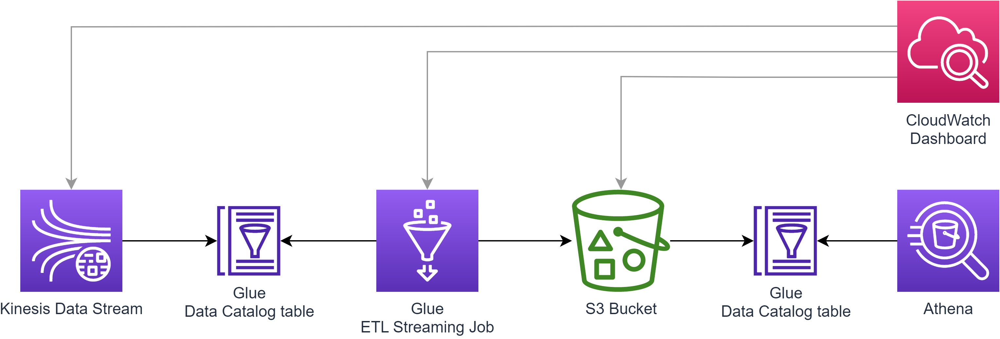
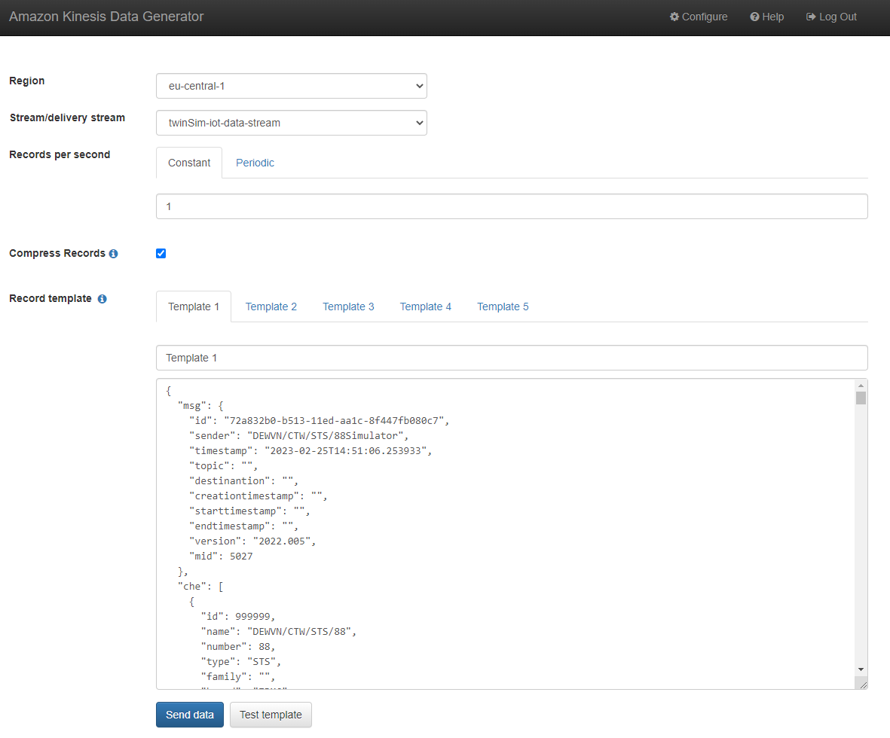

# AWS IoT TIC 4.0 Data Pipeline POC

This project provides an AWS CDK app for deploying the displayed IoT data pipeline into an AWS environment. The purpose
of the data pipeline is, to receive messages in the
[TIC 4.0 CHE Data Model 2022.003](https://tic40.atlassian.net/wiki/spaces/TIC40Definitions/pages/890961950/CHE+Data+Model+2022.003)
format, reduce the messages to the [defined subset](pipeline_stack/config/kpis/kpi_sample.json), and write the resulting
messages to S3 in near real time.

## Getting Started

### Prerequisites
- AWS credentials and config file.\
  ``%HOMEPATH%\.aws\credentials``
  ```
  [default]
  aws_access_key_id=<AWS_ACCESS_KEY>
  aws_secret_access_key=<AWS_SECRET_ACCESS_KEY>
  ```
  ``%HOMEPATH%\.aws\config``
  ```
  [default]
  region=<REGION>
  output=json
  ```
- Node.js 10.13 or later. (AWS recommends the [active LTS version](https://nodejs.org/))
- AWS CDK Toolkit v2.
  ```Shell
  npm install -g aws-cdk
  cdk --version
  ```
- Python 3.6 or later. ([download a compatible version](https://www.python.org/downloads/) for your operating system)

### Installation
1. Clone this repository.
   ```Shell
   git clone git@github.com:Storm-FSI/aws-iot-data-pipeline.git
   ```
2. Create a virtual Python environment within the root directory of the repository.
   ```Shell
   python -m venv .venv
   ```
3. Activate the virtual Python environment.\
   On Linux and macOS:
   ```Shell
   source .venv/bin/activate
   ```
   On Windows PowerShell:
   ```Shell
   .\.venv\Scripts\Activate.ps1
   ```
4. Install the CDK app dependencies into the virtual Python environment.
   ```Shell
   pip install -r requirements.txt
   ```


## Usage

### Context Variables
#### Required
- `account`
  - Description: The account number to use for the deployment of the CDK app.
- `region`
  - Description: The region to use for deployment of the CDK app.
- `organization`
  - Description: The organization name
- `environment`
  - Description: The environment name.
- `application`
  - Description: The application name.

#### Optional
- `kinesis-shard-count`
  - Description: The number of shards for the Kinesis data stream.
  - Default: 1
- `job-worker-type`
  - Description: The worker type for the Glue ETL Job.
  - Default: "G.025X"
- `job-number-of-workers`
  - Description: The number of workers for the Glue ETL Job.
  - Default: 2
- `job-max-concurrent-runs`
  - Description: The maximum number of concurrent runs for the Glue ETL job.
  - Default: 2
- `job-window-size`
  - Description: The window size of the Glue ETL job. This parameter determines, at which rate the Glue ETL Job gets
    triggered and therefore fetches and processes the data from the Kinesis data stream.
  - Default: "10 seconds"


### Deploy CDK app
#### 1. Activate virtual Python environment
Whenever you start working with the CDK application, your first step should be to activate your virtual Python
environment as described above.

#### 2. Bootstrap AWS environment
When bootstrapping an AWS environment, the CDK will deploy a CloudFormation Stack named ``CDKToolkit`` into it. Every AWS
environment only needs to be bootstrapped once. If the desired AWS environment has been bootstrapped already, this step
can be skipped.
```Shell
cdk bootstrap `
-c account='<ACCOUNT>' `
-c region='<REGION>' `
-c organization='<ORGANIZATION>' `
-c environment='<ENVIRONMENT>' `
-c application='<APPLICATION>' `
aws://<ACCOUNT>/<REGION>
```

#### 3. Synthesize CloudFormation Template
Before deploying the CDK app to your AWS environment, you need to synthesize the CloudFormation template for the code.
```Shell
cdk synth `
-c account='<ACCOUNT>' `
-c region='<REGION>' `
-c organization='<ORGANIZATION>' `
-c environment='<ENVIRONMENT>' `
-c application='<APPLICATION>' `
<ORGANIZATION>-<ENVIRONMENT>-<APPLICATION>
```

#### 4. Deploy CloudFormation Stack
After synthesizing the CloudFormation Template for the code, the resulting CloudFormation Stack can be deployed into the
AWS environment.
```Shell
cdk deploy `
-c account='<ACCOUNT>' `
-c region='<REGION>' `
-c organization='<ORGANIZATION>' `
-c environment='<ENVIRONMENT>' `
-c application='<APPLICATION>' `
<ORGANIZATION>-<ENVIRONMENT>-<APPLICATION>
```

#### 5. Configure Athena Query Editor
Configure the Athena Query editor to use the S3 bucket
`<organization>-<environment>-<application>-athena-results-<account>-<region>` for the Athena query results.

#### 6. Start the Job
Manually start the Glue ETL Streaming Job via the AWS Management Console.

### Delete CDK app

#### 1. Destroy CloudFormation Stack
Destroying the CloudFormation Stack will delete all resources managed by the Stack except the S3 output bucket.
```Shell
cdk destroy `
-c account='<ACCOUNT>' `
-c region='<REGION>' `
-c organization='<ORGANIZATION>' `
-c environment='<ENVIRONMENT>' `
-c application='<APPLICATION>' `
<ORGANIZATION>-<ENVIRONMENT>-<APPLICATION>
```

#### 2. Delete S3 Output Bucket
Delete the S3 output bucket named ``<organization>-<environment>-<application>-output-bucket-<account>-<region>``.


## Testing

#### 1. Setup Kinesis Data Generator
For using the Amazon Kinesis Data Generator, you need to create an Amazon Cognito user in your account with permissions
to access Kinesis. This process is documented [here](https://awslabs.github.io/amazon-kinesis-data-generator/web/help.html).
You can use CloudFormation to simplify the process.

#### 2. Inject Sample Data
After you have created the Amazon Cognito user CloudFormation Stack, you can inject sample data into your Kinesis data
stream by using the Data Generator and [sample_data.json](docs/sample_data/sample_data.json).\
\


#### 3. Query S3 using Athena
As soon as the sample data has been written to S3 by the Glue ETL Job, you can query it via the Athena Query editor.
```roomsql
SELECT *
FROM "<organization>-<environment>-<application>-output-database"."<organization>-<environment>-<application>-output-table"
LIMIT 10;
```
